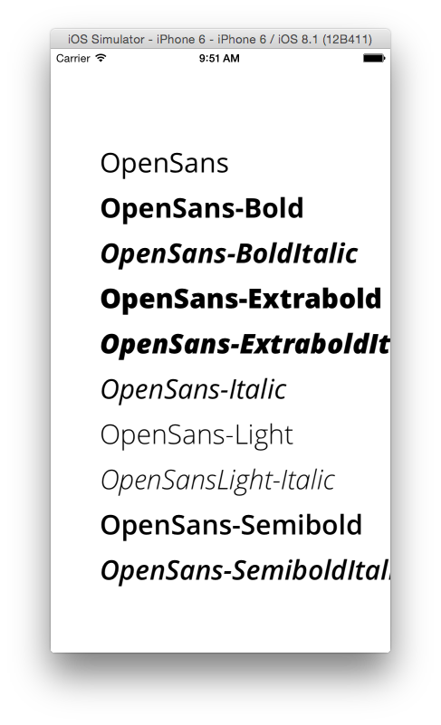
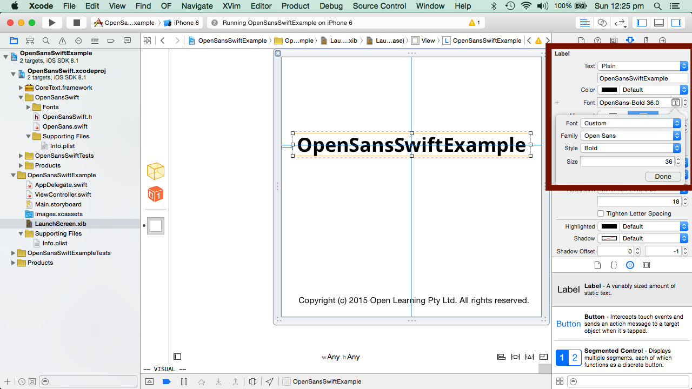

[](https://github.com/Carthage/Carthage)

## OpenSansSwift ##
Easily use the OpenSans font in Swift



## Why use OpenSansSwift frameworks ? ##

The usual process of embedding any custom fonts in your IOS applications has a few steps:

1. Copy all your font resources to your project
2. Make sure they're copied to the bundle
3. Add UIAppFonts key to info.plist.
4. Painstakingly add all the font names with the right extension
5. Find out the font family and font names programatically
6. Use the fonts

For the OpenSans font, this framework does all that for you. All you have to do is link the compiled framework.

## How to Install - Carthage ##

If you dont' already have Carthage, Install it with:

```
$ brew update
$ brew install carthage
```

Add ```github "hemantasapkota/OpenSansSwift"``` to your Cartfile.

Execute ```carthage install```

## OpenSans Font Methods ##

Based on *OpenSans v2.0*, *OpenSansSwift* registers the following methods:

```
    openSansFontOfSize(size: Float) -> UIFont!
    openSansBoldFontOfSize(size: Float) -> UIFont!
    openSansBoldItalicFontOfSize(size: Float) -> UIFont!
    openSansExtraBoldFontOfSize(size: Float) -> UIFont!
    openSansExtraBoldItalicFontOfSize(size: Float) -> UIFont!
    openSansItalicFontOfSize(size: Float) -> UIFont!
    openSansLightFontOfSize(size: Float) -> UIFont!
    openSansLightItalicFontOfSize(size: Float) -> UIFont!
    openSansSemiboldFontOfSize(size: Float) -> UIFont!
    openSansSemiboldItalicFontOfSize(size: Float) -> UIFont!
```

## Usage - Programmatically ##

See Example for more details.

```
import UIKit
import OpenSansSwift

class ViewController: UIViewController {

    override func viewDidLoad() {
        super.viewDidLoad()    
        
        //Register Open Sans fonts. Register only once.
        OpenSans.registerFonts()
        
        // Create a label
        let lbl1 = UILabel(frame: CGRectMake(x, y, size.width, size.height))
        
        lbl1.font = UIFont.openSansFontOfSize(30)
        
        lbl1.text = "This is OpenSans-Regular"
        self.view.addSubView(lbl1)
    }
}
```

## Usage - Storyboard ##

XCode automatically detects the fonts present in the bundle, so you don't have to perform any registration for use in Storyboards.



## Licence ##

* MIT for OpenSansSwift framework.

* Apache for OpenSans v2.0 fonts. See http://www.apache.org/licenses/
